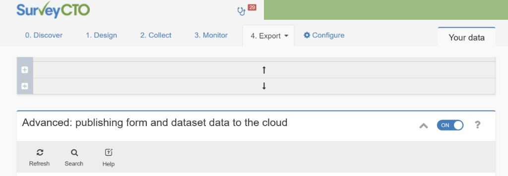
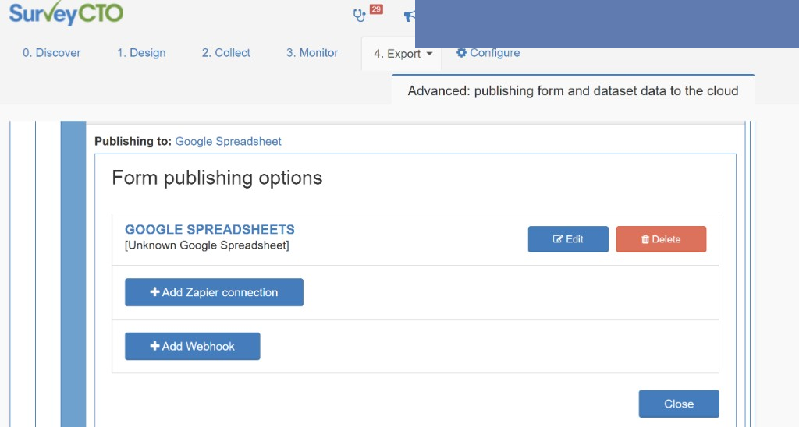
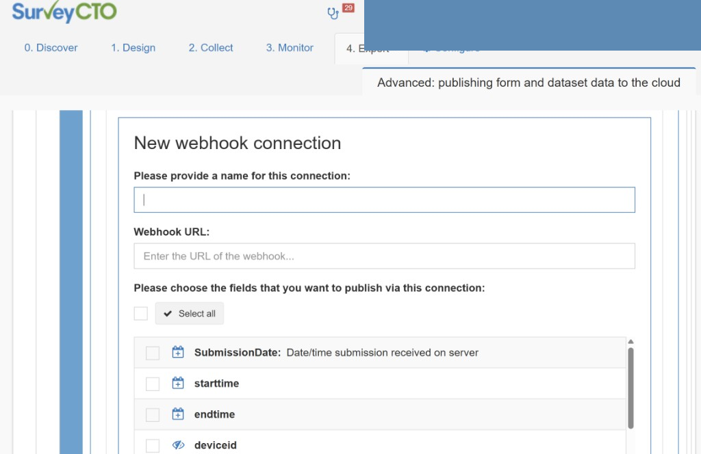
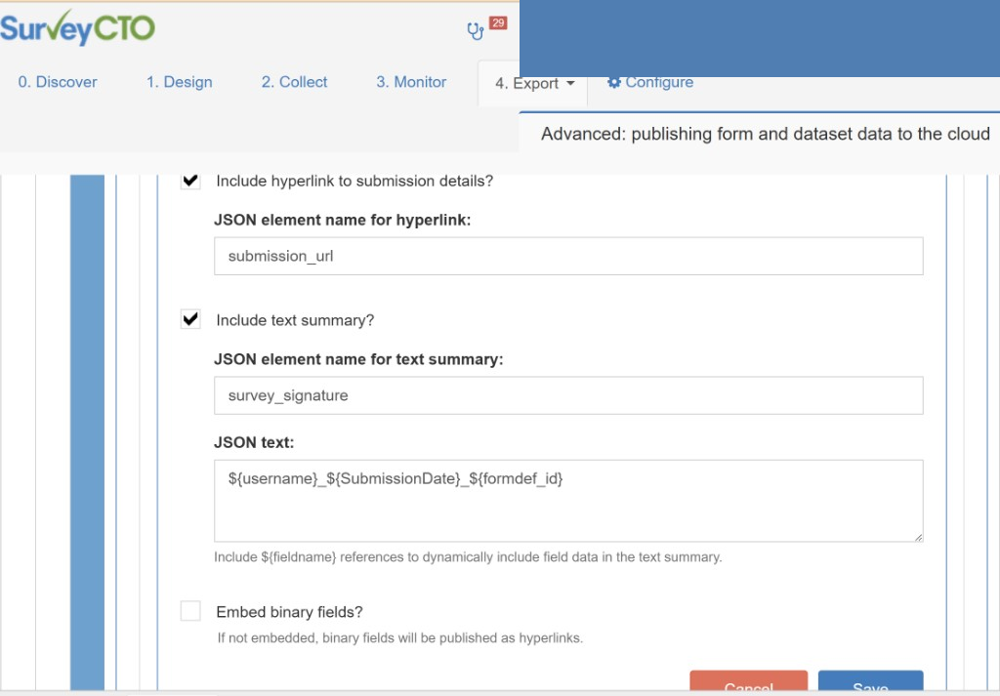

# SurveyCTO — Publishing to other systems via webhooks

> **<u>This document covers how to configure the webhook on the SurveyCTO side. If you are looking for how to build and connect a REST API to receive SurveyCTO webhooks, see the [README](../README.md).</u>**

---

> This is an expanded companion guide based on SurveyCTO's official page
> [Publishing to other systems via webhooks](https://docs.surveycto.com/05-exporting-and-publishing-data/03-publishing-data-to-the-cloud/05.forms-to-webhooks.html).
> It follows the same section order as the official docs and adds practical detail for people building a webhook receiver.
> It is not official SurveyCTO documentation. For authoritative product behavior, use SurveyCTO's docs and support.

Screenshots below are from a SurveyCTO server console. Personal account details have been redacted.

---

## Overview

Webhooks allow web services to trigger actions, push data, or otherwise connect to other web services. Initially the exclusive domain of programmers who sought to use certain technologies and conventions to connect systems, webhooks are increasingly useful to non-programmers as well. You can use webhooks to publish incoming SurveyCTO form data to a wide variety of outside systems, but typically you will need some technical expertise and/or instructions from the receiving system in order to successfully configure everything.

## What you need on your side

| Requirement | Why |
|-------------|-----|
| HTTPS URL | SurveyCTO must POST to your server over the public internet. |
| HTTP POST handler | Your app accepts JSON in the request body. |
| Fast response (200 OK) | Return success quickly; do slow work afterward (database, downloads, queues). |
| Field mapping | Your code must understand the field names you select in the SurveyCTO console. |

---

## Getting started

Go to your server console's Export tab, scroll down to the Advanced: publishing form and dataset data to the cloud section, and click the ON/OFF toggle to ON if you haven't already enabled cloud publishing.



*Figure 1: Export → Advanced: publishing form and dataset data to the cloud → toggle ON.*

Before adding a webhook, make sure:

- Cloud publishing is ON
- Your receiving app is deployed and reachable at an HTTPS URL
- You know which form should send data
- You know which fields (and file questions) the receiver needs

---

## Configure a webhook for a form

To configure any one of your forms to publish via webhooks, click on the Configure option for that form, and then click Add Webhook in the panel that appears.



*Figure 2: Configure on a form → Form publishing options → + Add Webhook.*

### Webhook URL

Enter the full URL SurveyCTO should POST to, for example:

```text
https://api.example.org/webhook/surveycto
```

The path (`/webhook/surveycto`) must match what your application expects. In this repo's example app, the default path is set in `app/config/appconfig.ini` under `[webhook] path`.

### Name and fields to publish

Choose a good name for your webhook connection, based on the system you're publishing to and what you intend to publish.

Then select which form fields to publish:

- For encrypted forms, only fields explicitly marked as publishable will be listed.
- Use the Select all button if you want to publish every listed field.

The JSON body will contain only the fields you select (plus any optional extras described below). If your receiver expects a field, you must select it here.



*Figure 3: New webhook connection — connection name, Webhook URL, and checkboxes for each field to publish.*

---

## Other options

You have a few other options available when configuring the webhook.

### 1. Hyperlink to the full submission

You can choose whether or not to include a hyperlink to the full submission in SurveyCTO in the published data.

If you do include the hyperlink and you also happen to be publishing a form field named `submission_url`, choose a different name for the hyperlink to avoid a naming conflict.

This link is useful if operators need to open the submission in SurveyCTO for review or correction.

---

### 2. Extra summary field

You can include one extra field as a text summary of the submission — useful as a title or alert text depending on the system you're publishing to.

You choose the field's name and contents. In the contents, you can use `${fieldname}` references to pull in data from the submission, just like in a form label. For example:

```text
Submission received from ${enumerator_name}, for household headed by ${hh_head}
```

Note that in encrypted forms, you can only reference publishable fields.



*Figure 4: Webhook options screen. Sensitive values are blurred — use your own element names and JSON text in production.*

Example of what a published payload might include:

```json
"submission_summary": "Received from collector@example.org on 2025-07-01T15:07:53.416Z"
```

A note on security: treat any text-summary pattern as non-secret. Anyone receiving webhooks can see the values and reconstruct the string. Use HTTPS, network restrictions, and proper auth (API keys, HMAC, etc.) for real protection — not a custom summary field alone.

Also make sure to publish the underlying fields you reference (e.g. `username`, `SubmissionDate`, `KEY`) in the field list if your receiver needs them separately from the summary text.

---

### 3. Embed binary fields

You can choose to embed the contents of binary fields (files attached to submissions) in the published data.

| Setting | What the webhook contains |
|---------|---------------------------|
| Embed OFF (default) | File fields publish as metadata and/or hyperlinks — not raw file bytes. |
| Embed ON | File contents are included in the payload (larger body, slower processing). |

You can't embed binary fields for encrypted forms.

When binary embed is off, a repeat group with image questions typically looks like:

```json
"attachments": [
  { "file": { "filename": "photo-1.jpg", "type": "image/jpeg" } },
  { "file": { "filename": "photo-2.jpg", "type": "image/jpeg" } }
]
```

Repeat group and file field names come from your form. Map them in `app/config/appconfig.ini`:

```ini
attachment_repeat_group = attachments
attachment_field = file
```

See `examples/README.md` and `examples/sample_submission_register_photos.json` for another naming pattern.

---

### 4. Publish existing data

Check Publish existing data if you want to also publish existing form submissions. If you leave it unchecked, only new submissions that come in after you configure the webhook will be published.

---

## Publishing

As submissions come in to the server, your selected fields will be automatically published to your chosen webhook — but there will be a brief delay of up to ten minutes.

- SurveyCTO sends an HTTP POST with JSON to your webhook URL.
- Delivery is not instant; wait up to 10 minutes when testing.
- Your endpoint should return HTTP 200 quickly.
- Log the submission `KEY` (and time received) so you can match delayed deliveries and avoid duplicate processing.

### Common metadata fields

Exact fields depend on your form and what you selected to publish. Receivers often rely on:

| Field | Typical meaning |
|-------|-----------------|
| `KEY` | Unique submission id (often `uuid:...`) |
| `username` | Collector / enumerator account |
| `SubmissionDate` | ISO timestamp of submission |
| `formdef_id` | Form version identifier |

### HTTP contract

```http
POST /webhook/surveycto HTTP/1.1
Host: your-server.example.org
Content-Type: application/json

{ ... JSON body ... }
```

Recommended response:

```http
HTTP/1.1 200 OK
Content-Type: application/json

{ "response": "Success" }
```

Keep the handler fast. Move heavy steps (SQL, image download, external APIs) to a background job.

### Minimal sample payload

See `examples/sample_submission.json` in this repository:

```json
{
  "SubmissionDate": "2025-07-01T15:07:53.416Z",
  "username": "collector@example.org",
  "formdef_id": "example_form",
  "KEY": "uuid:00000000-0000-0000-0000-000000000001",
  "submission_summary": "Received from collector@example.org on 2025-07-01T15:07:53.416Z",
  "attachments": [
    { "file": { "filename": "photo-1.jpg", "type": "image/jpeg" } }
  ]
}
```

### Local testing

```bash
# Parse example JSON without SurveyCTO
python scripts/manual_webhook_test.py

# Or POST while the server is running
uvicorn app.main:app --host 0.0.0.0 --port 8000
curl -X POST http://localhost:8000/webhook/surveycto \
  -H "Content-Type: application/json" \
  -d @examples/sample_submission.json
```

---

## Troubleshooting

| Symptom | Things to check |
|---------|-----------------|
| No POST received | Cloud publishing ON; webhook on the correct form; URL is HTTPS and public; wait 10 minutes |
| 400 from example app | Demo validation in code rejected the payload — adjust `webhook_service.py` or your text summary to match your setup |
| Missing form fields | Field not selected in webhook config; encrypted field not marked publishable |
| No files / only filenames | Embed binary is off — expected; use SurveyCTO URLs or APIs to fetch bytes |
| Wrong attachment structure | `attachment_repeat_group` / `attachment_field` in `appconfig.ini` must match your form JSON keys |
| Timeouts or errors on SurveyCTO side | Receiver too slow or returning 5xx — return 200 quickly and process async |

---

## Related resources

| Resource | Link |
|----------|------|
| Official SurveyCTO page | [Publishing to other systems via webhooks](https://docs.surveycto.com/05-exporting-and-publishing-data/03-publishing-data-to-the-cloud/05.forms-to-webhooks.html) |
| Cloud publishing overview | [Introduction to cloud publishing](https://docs.surveycto.com/05-exporting-and-publishing-data/03-publishing-data-to-the-cloud/) |
| Example payloads | [`examples/README.md`](../examples/README.md) |
